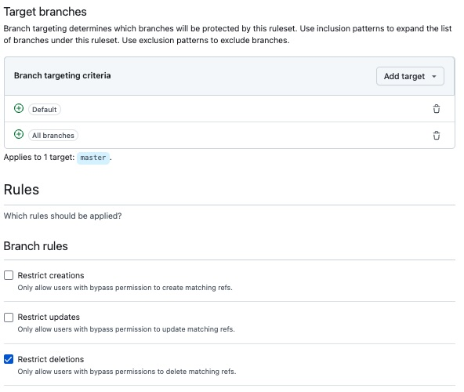

# Cycode CSM Interview Assignment

Below are the steps taken to complete the Cycode CSM interview Assignment

## Deploy a Vulnerable Application

I chose to use the [OWASP Juice Shop](https://owasp.org/www-project-juice-shop/) application. OWASP Juice Shop is one of the most modern and sophisticated insecure web applications. It is frequently used in security trainings, awareness demos, CTFs and as a guinea pig for security tools. Juice Shop encompasses vulnerabilities from the entire [OWASP Top Ten](https://owasp.org/www-project-top-ten) along with many other security flaws found in real-world applications.

Steps to set up the OWASP Juice Shop application

1. I used my [existing GitHub account](https://github.com/stevenjweaver), and [forked](https://github.com/stevenjweaver/juice-shop) the existing Juice Shop project into my account. 
2. I preferentially use a AMD-64 based Mac, and typically use [Fork](https://git-fork.com/) as my Git client. I find that Fork is a really good Mac client with great support for things like interactively rebasing and handling merges. 
3. I cloned the forked repo to my desktop.

## Run the Sample Application

4. **Running the sample application.** Running Juice shop should be fairly straightforward - it's just a couple of steps once the repository is cloned to the desktop:

	1. Go into the cloned folder with `cd juice-shop`
	2. Run `npm install` (only has to be done before first start or when you change the source code)
	3. Run `npm start`
	4. Browse to <http://localhost:3000>
However, the source distribution is only for x86 machines, not the latest ARM-based Macs. Because of that, the easiest way to run the Juice Shop application locally is to use Docker Desktop. Fortunately, I already had it installed, but it's straightforward to setup.

Installing Juice Shop into docker  is just 2 steps:

	1. Run `docker pull bkimminich/juice-shop`
	2. Run `docker run --rm -p 127.0.0.1:3000:3000 bkimminich/juice-shop`
	3. Browse to <http://localhost:3000>

Once the install is completed, the OWASP Juice Shop app is accessible: 

## Create the output.md file

5. Following the completion of the above step, I created this output.md file, and merged with the master branch of my repo using Fork.
	
	1. Create output.md file in local cloned repository: `touch output.md`
	2. Edit output.md using [Sublime Text](https://www.sublimetext.com/) (my preferred text editor): `open output.md`
	3. Once done, I needed to add the file to the repo anc commit it: `git add output.md`,`git commit -m "Add Output file for Documentation"`
	4. I then used Fork to push merge the file directly to the master branch. 

## Implement Branch Protection Rules

6. It's not a recommended best practice to directly merge a commit to the master branch. Merging directly with the master branch in GitHub can lead to several issues, especially when a developer is working in a collaborative development environment. Some of the main reasons why this is discouraged include:

	1. **Risk of Introducing Bugs:** Directly merging changes into the master branch can introduce untested code, potentially leading to bugs or breaking existing functionality. For that reason, it’s important to review and test changes before integrating them into the main codebase. Using a branching strategy, such as feature branches, allows for thorough testing and validation of code before merging with the master branch.
	2. **Conflict Management:** Merging directly can lead to more complex merge conflicts, especially in a team environment.
	3. **Lack of Code Review:** Typically merging directly into the master branch means skipping peer review, where other team members can provide feedback, catch errors, or suggest improvements. 
	4. **No Clear History:** Direct merges opens up the possibility of clouding the project’s history, making it difficult to track the evolution of code. 
	6. **CI/CD:** For team environments, dev teams using automated CI/CD automatically run tests and validate code once changes are pushed to a specific branch. Merging to the master branch would bypass these tests, increasing the chance of introducing bugs.
	7. **HArd to follow Work in Progress:** Working in separate branches makes it easier to manage and track work in progress, especially for team environments. 

**Best Practices:** Instead of merging directly into the master branch, dev teams will ususally implement some of the following practices:

- **Use Feature Branches:** Create a separate branch for each new feature or bug fix to isolate changes.
- **Pull Requests:** Utilize pull requests to propose changes.
- **Continuous Integration:** Implement CI pipelines that run tests on branches before merging.

7. In our Juice Shop repository, I can also change the repository settings to prevent automatically merging to the main branchby enabling **branch protection rules**. Here are the steps I took:

	1. In the Juice Shop repository, click on the **Settings** tab.
	2. In the sidebar, click on **Branches**. This section allows you to manage branch protection rules.
	2. Click on **Add branch ruleset**.
	3. Under the **New branch ruleset**, add a **Ruleset Name**, provide an optional bypass list, identify the target branch, then add Branch rules.
	5. There are several options to enable protection, including:
		- Require pull request reviews before merging.
		- Require status checks to pass before merging.
		- Require signed commits.
		- Require code scanning results.
	6. After configuring the desired settings, click on **Create** to apply the branch protection rule.

	
